# MarisolBoard
스프링 프레임워크를 이용한 회원제 게시판

## 목차

### 1. [프로젝트 개요](#1-ed9484eba19ceca09ded8ab8-eab09cec9a94-1)
### 2. [프로젝트 문서](#2-ed9484eba19ceca09ded8ab8-ebacb8ec849c-1)
### 3. [주요 기능 및 구현 화면](#3-eca3bcec9a94-eab8b0eb8aa5-ebb08f-eab5aced9884-ed9994eba9b4-1)

## 1. 프로젝트 개요

### 🎯 목표

인트라넷 (파일을 첨부하여 게시글을 작성할 수 있는 회원제 게시판) 개발

- **프로젝트 목표**: SpringFramework를 이용한 애플리케이션 개발에 대한 이해향상 및 기술 습득
- **프로젝트 수행 기간**: 2023년 04월 24일~2023년 05월 26일 ( 약 1개월 ) + 추가 1주일
 
 

### ⚒️ 기술 스택

### 🚀 개발 및 배포 환경
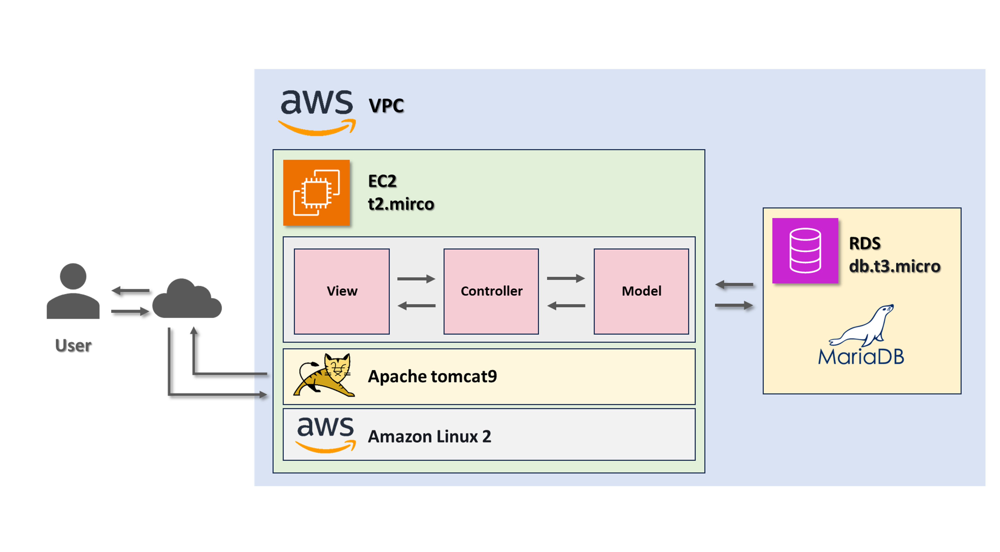

## 2. 프로젝트 문서

### 📝 요구사항 정의 및 페이지·기능 명세서

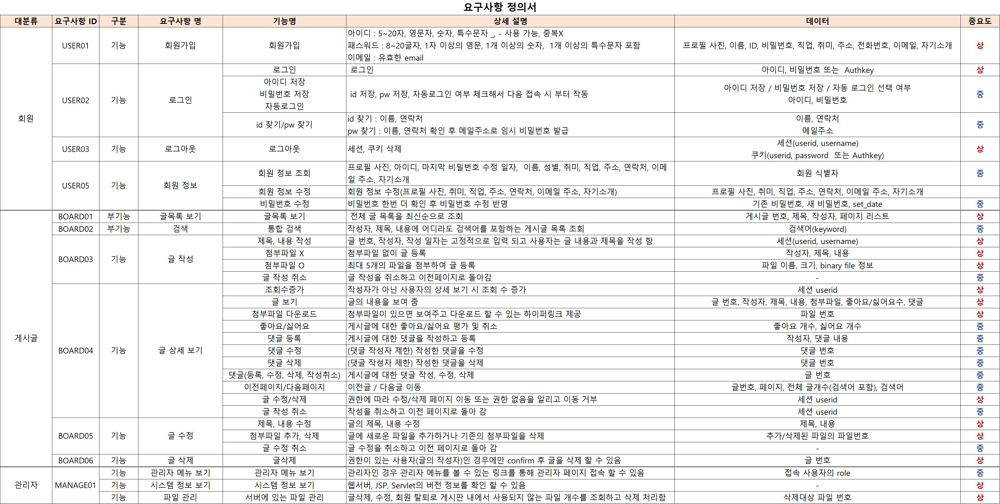

### 📝 테이블 명세서 및 ERD

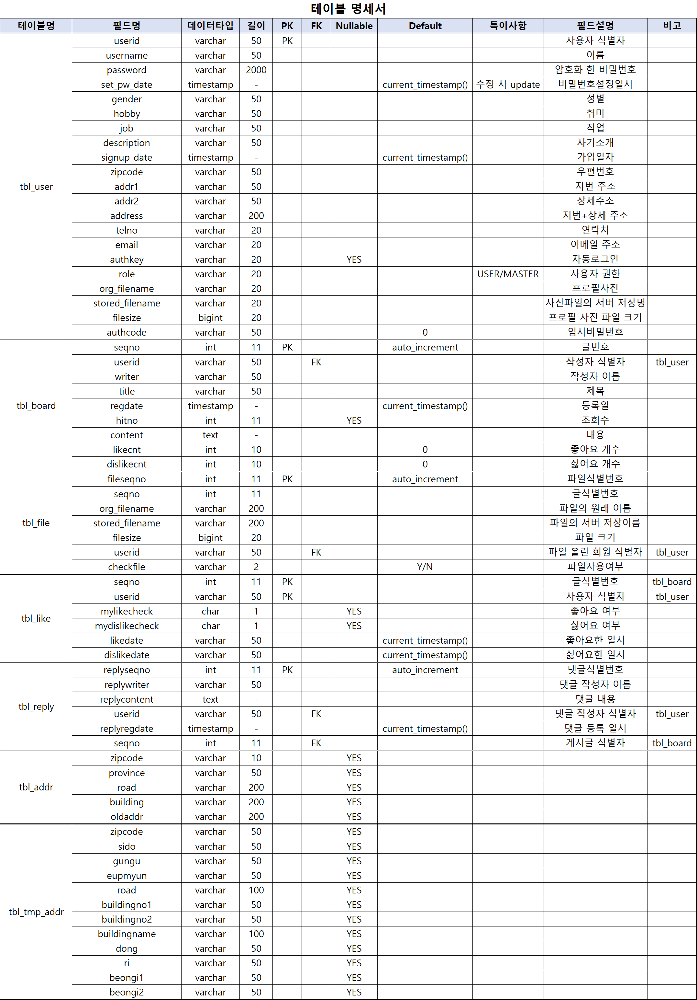
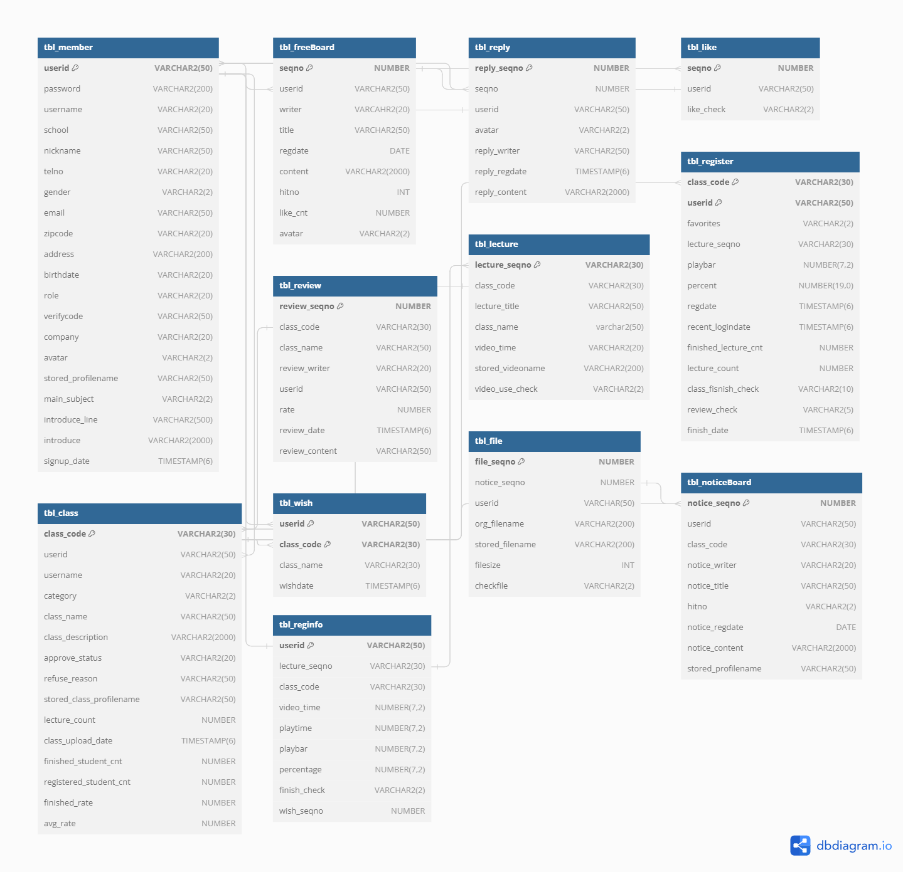

## 3. 주요 기능 및 구현 화면

### 🪪 회원 기능
  - 회원가입
    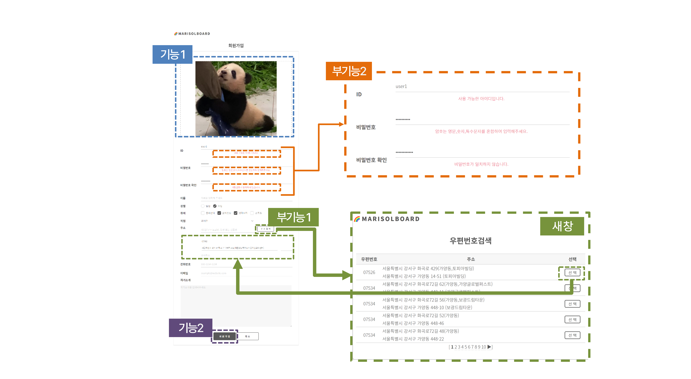

    

    
    | 기능 |   | 부기능  |   |
    |-------|-------|-------|-------|
    | 1 | 프로필 사진 추가 | 1 | 우편번호 검색 |
    | 2 | 회원가입 처리 | 2 | 입력정보 피드백 제공 |

    

      

  - 로그인
    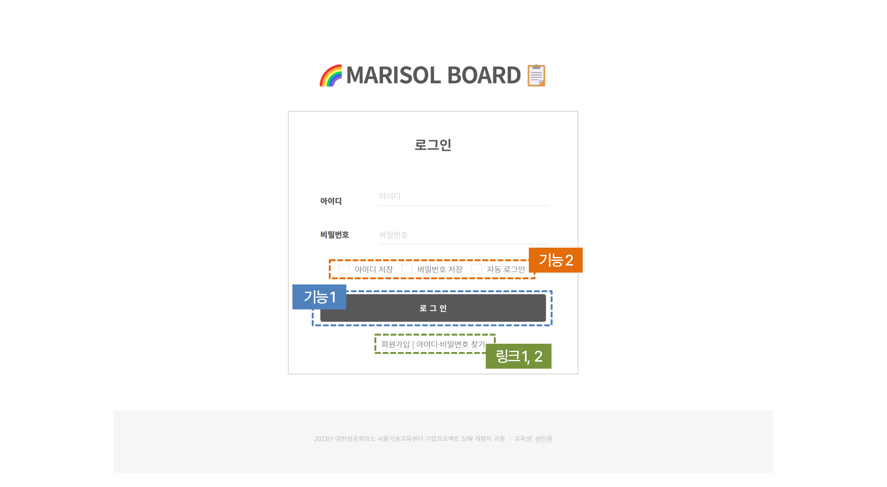
    
    

    
    | 기능 |   | 링크  |   |
    |-------|-------|-------|-------|
    | 1 | 로그인 | 1 | 회원가입 화면 |
    | 2 | 아이디·비밀번호 저장 | 2 | 아이디·비밀번호 찾기 화면 |
    | 3 | 자동 로그인 |  |  |

    

      

  - 비밀번호 변경 주기 알림
    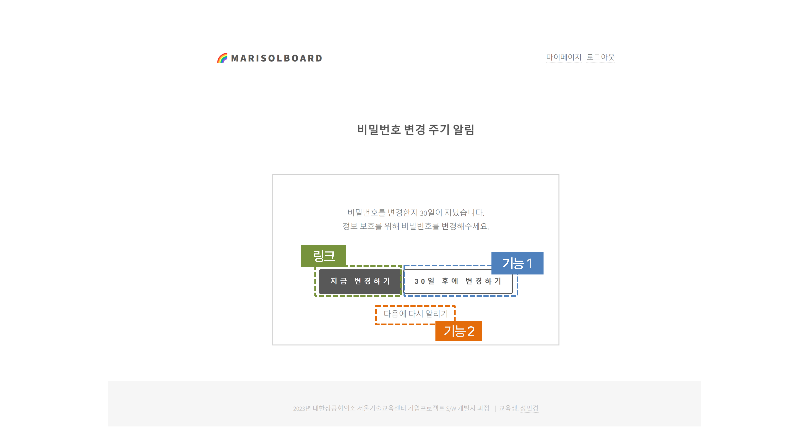
    
    

    
    | 기능 |   | 링크  |   |
    |-------|-------|-------|-------|
    | 1 | 비밀번호 변경 주기 30일 연장 | 1 | 비밀번호 변경 화면 |
    | 2 | 다음 로그인 시 알리도록 설정 |  |  |

    

      

  - 아이디 찾기
    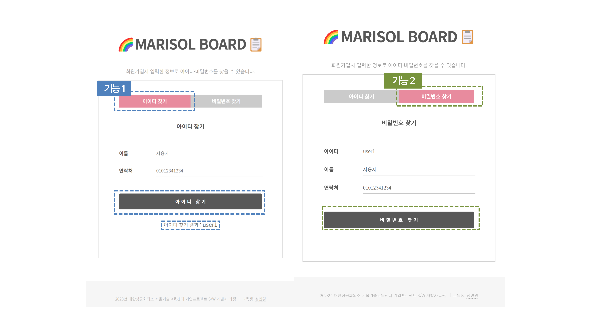
    
    

    
    | 기능    | |
    |---------|-|
    | 1 | 아이디 찾기  |
    | 2 | 비밀번호 찾기 - 임시비밀번호 발급  |

    

    - 이메일로 임시 비밀번호가 발급된 화면
    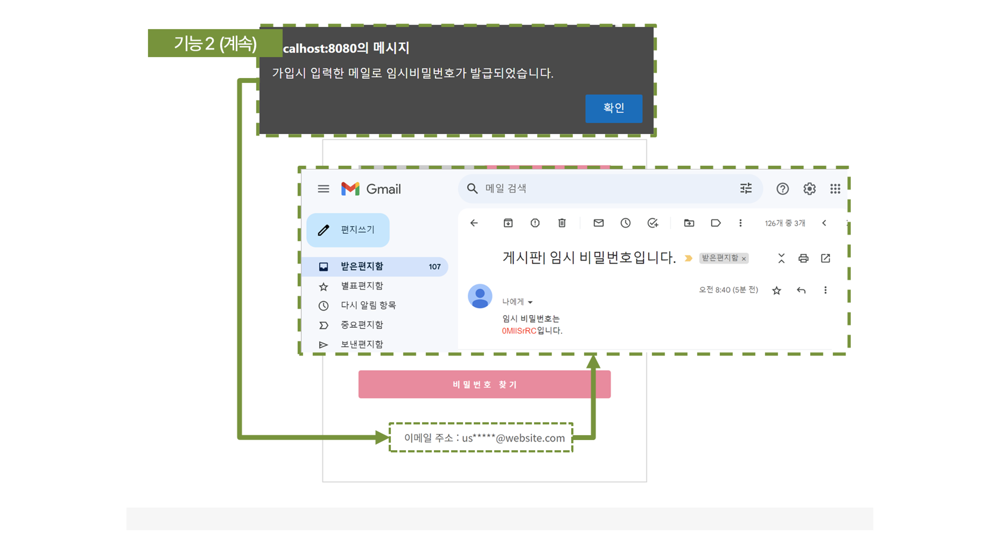
  
  - 회원 정보수정 및 비밀번호 변경
    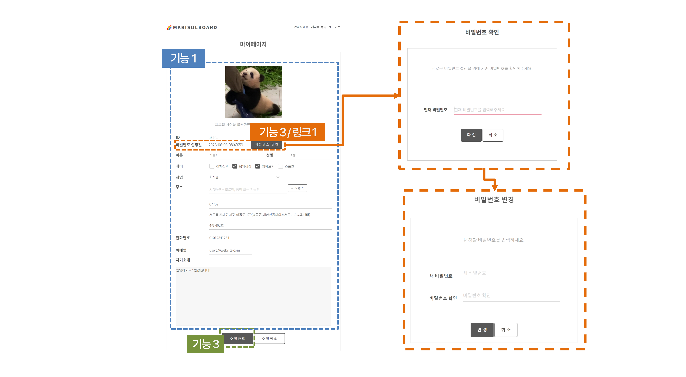

    

    
    | 기능 |   | 링크  |   |
    |-------|-------|-------|-------|
    | 1 | 가입 시 입력 정보 조회 및 수정 | 1 | 비밀번호 변경 화면 |
    | 2 | 정보 수정 처리 |  |  |
    | 3 | 최근 비밀번호 설정 일자 확인|  |  |

    

      

### 📋 게시판 기능
  - 글 목록
    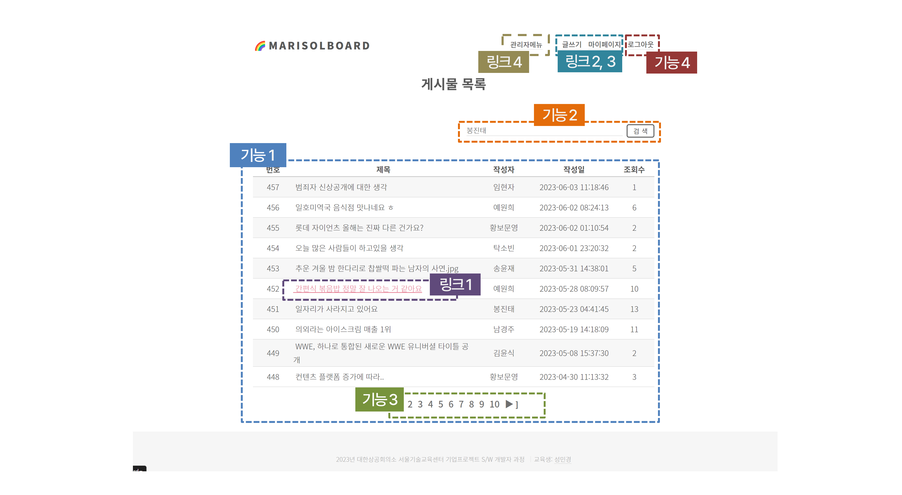

    

    
    | 기능 |   | 링크  |   |
    |-------|-------|-------|-------|
    | 1 | 전체 게시글 목록 조회 | 1 | 게시글 상세 보기 화면 |
    | 2 | 검색 결과 게시글 목록 조회 | 2 | 글쓰기 화면 |
    | 3 | 페이지 이동 | 3 | 마이페이지 화면 |
    | 4 | 로그아웃 처리 | 4 | (관리자만) 관리자 메뉴 화면 |

    

      

  - 글 쓰기
    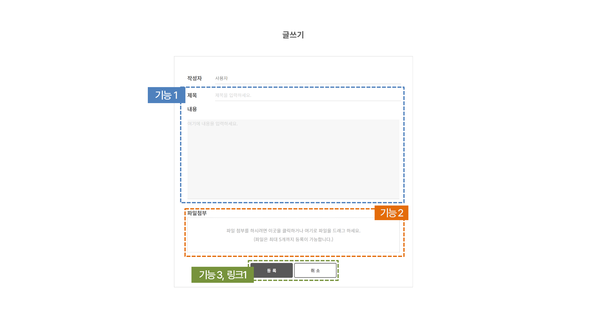

    

    
    | 기능 |   | 링크  |   |
    |-------|-------|-------|-------|
    | 1 | 글 (제목·내용)작성 | 1 | 글 등록 취소 - 이전 화면 |
    | 2 | 파일 첨부 |  |  |
    | 3 | 글 등록 처리 |  |  |

    

      

  - 글 상세보기
    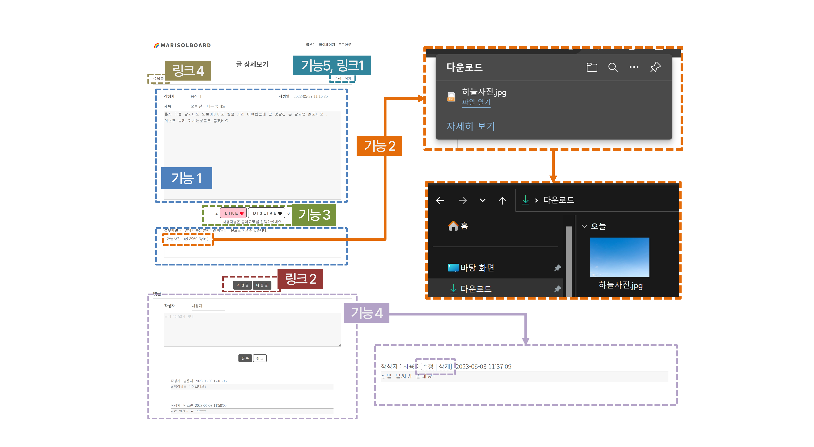

    

    
    | 기능 |   | 링크  |   |
    |-------|-------|-------|-------|
    | 1 | 글 내용·첨부파일조회 | 1 | (작성자만) 글 수정 화면 |
    | 2 | 첨부파일 다운로드 | 2 | 이전·다음 글 상세 보기 화면 |
    | 3 | 좋아요·싫어요 평가 | 3 | 목록 화면 |
    | 4 | 댓글 조회·등록·수정·삭제 |  |  |
    | 5 | (작성자만) 게시 글 삭제 |  |  |

    

      

  - 글 수정
    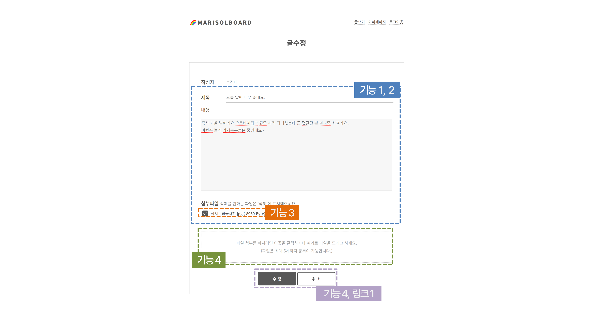

    

    
    | 기능 |   | 링크  |   |
    |-------|-------|-------|-------|
    | 1 | 글 내용·첨부파일조회 | 1 | 수정 취소 - 글 상세보기 화면 |
    | 2 | 글 제목·내용 수정 |  |  |
    | 3 | 첨부파일 삭제 |  |  |
    | 4 | 새 첨부파일 등록 |  |  |
    | 5 | 수정 사항 등록 |  |  |

    

      

### 🧑‍🔧 관리자 기능
  - 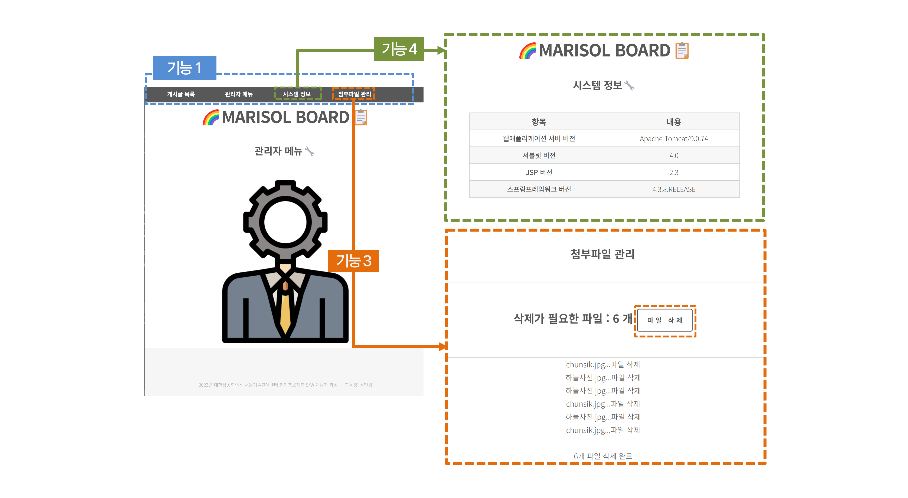

    

    
    | 기능 |   | 
    |-------|-------|
    | 1 | 관리자 메뉴 조회 |
    | 2 | 시스템 정보 조회 |
    | 3 | 첨부 파일 관리 (삭제) |

    

      
